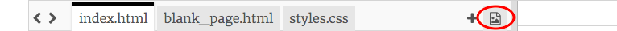

1. Go to dojo.soy/trinket-challenge and click Remix. You will need to be signed in to Trinket.

2. Go to the tab _styles.css_. There you can see what colours are defined for the website. The text colour is `color` and the background is `background-color`. Change the values to colours that you like. For a list of colour names you can use, see dojo.soy/html-colours

3. For the next step you’ll need a picture of a zoo animal that you like. It needs to be saved on your computer. If you don’t have one handy, you can search the internet and download a picture, or even draw one.

4. Click the image icon to the right of the tabs, then **Add Image**, then **Upload**, then **Click To Select Files**. Find the picture file on your computer, select it and click Open. Click **Done**.   
    

5. Now click on the index.html tab, and add the following line of code on a new line after the last `</p>` tag.

   ```html
        
   ```

   * Change “lions.jpg” to the filename of your picture. It must match the file name exactly. The picture should appear on your page when you click Run.
6. If you want to change the size of your picture, go to **styles.css** and change the number after `width`. If you delete any of the other letters or symbols, be sure to type them back in! It should look like this: `width: 150px;`

6. Let’s turn it into a link that takes you to a page all about the animal! First, create a new page: click the **+** next to the image icon and type **lion.html** where it says “file name”.
   * Change it to whatever animal you have, but be sure the name ends in **.html** as this is what makes it a **web page**.

7. Go to the file _blank\_page.html_. There you'll see all the code you need for a blank page. Copy that into your new file.

8. To add a paragraph of text, click in the blank space between the`<main></main>`tags and type `<p></p>`. Type your text in between the tags, like this:

   ```html
       <p>This page is all about lions!!!!</p>
   ```

   You can add as many paragraphs like this as you want.

   * Can you add pictures too?

9. Go back to index.html. To turn your picture into a link you need to put it in between a pair of `<a></a>` tags, like this:

   ```html
       <a href="lion.html"></a>
   ```

   Change **lion.html** to the name of the new page you created.

10. Now when you click run, you should be able to click on the picture and see the page about that animal.

11. On a new line underneath your image and link code, write some more code to show another picture that links to another new page. Don’t forget to upload a file for your picture! Do as many as you like! What animals are in your zoo?

To learn how to do more with your website and earn yourself a digital badge, visit dojo.soy/begin-html-sushi and try the Beginner HTML CSS Sushi cards!



