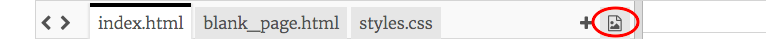

1. En este proyecto, ¡vas a crear un sitio web para un zoo! Visita [dojo.soy/mini-trinket](http://dojo.soy/mini-trinket) y haz clic en **Remix**. Necesitarás darte de alta en Trinket. Después de hacer clic en **Remix**, haz clic en el botón **Save**.

2. Haz clic en tu nombre de usuario en la esquina superior derecha de la pantalla y selecciona **My Trinkets**. Localiza el proyecto que acabas de crear, denominado "WebPictures Remix", y haz clic sobre él para abrirlo.

3. En **code pane** ve a la ficha `styles.css`. Ahí podrás ver los colores que se usarán en el sitio web. El color del texto es `color` y el color del fondo es `background-color`. Cambia los valores a los colores que desees. Si deseas una lista con los nombres de los colores que puedes usar, visita [dojo.soy/mini-web-colours](http://dojo.soy/mini-web-colours).

4. Para el siguiente paso necesitarás una foto del animal del zoo que prefieras. Tiene que estar guardada en tu ordenador. Si no tienes una a mano, puedes descargar una de Internet o incluso dibujar la tuya.

5. Haz clic en el icono de la imagen a la derecha de las fichas de código, a continuación, **Add Image**, **Upload** y **Click To Select Files**. Localiza el archivo de imagen en tu ordenador, selecciónalo y haz clic en **Open**. Haz clic en **Done**.   
    

6. Ahora, haz clic en la ficha `index.html` y añade la siguiente línea del código en una nueva línea después de la última etiqueta `</p>`.

   ```html
        
   ```

   * Cambia `lions.jpg` por el nombre de archivo de tu imagen. Debe coincidir exactamente con el nombre del archivo. La imagen debe aparecer en tu página.
   
7. Si deseas cambiar el tamaño de la imagen, accede a `styles.css`. Las normas de las imágenes están en el bloque `img`:
   ```css
      img {
        width: 200px;
      }
   ``` 
   Cambia el número después de `width`. Si borras cualquiera de las otras letras o símbolos, ¡asegúrate de volver a escribirlos! Debe tener este aspecto: `width: 450px;`

8. ¡Convirtámoslo en un enlace que te lleve a una página con información sobre el animal! En primer lugar crea una nueva página: haz clic en **+** al lado del icono de imagen y escribe `lion.html` en **file name**.
   * Puedes cambiarlo al animal que tengas, pero asegúrate de que el nombre acabe en `.html` puesto que esto es lo que lo convierte en una **página web**. 

9. Ve al archivo `blank_page.html`. Allí verás todos los códigos necesarios para una página en blanco. Cópialos en tu nuevo archivo.

10. Para añadir un párrafo de texto, haz clic en el espacio en blanco entre las etiquetas `<main></main>` y escribe `<p></p>`. Anota el texto entre las etiquetas, así: `<p>¡¡Esta página te cuenta todo sobre los leones!!</p>`. Puedes añadir tantos párrafos de este tipo como quieras.
   * ¡Intenta también añadir imágenes!

11. Vete a `index.html`. Localiza el código de tu imagen y colócalo entre un par de etiquetas `<a></a>`, así:

   ```html
       <a href="lion.html"></a>
   ```
   Cambia `lion.html` por el nombre de la nueva página que hayas creado.

12. ¡Acabas de transformar tu imagen en un enlace! Debes ser capaz de hacer clic en la imagen y ver la página sobre el animal.

13. En una nueva línea debajo de tu imagen y el código del enlace, escribe más códigos para que muestren otra imagen que lleve a nueva página. ¡No te olvides de cargar un archivo para tu imagen y crear una nueva página! Añades tantas imágenes y páginas como quieras. ¿Qué animales hay en tu zoo?

14. No te olvides de hacer clic en **Save** de vez en cuando para asegurarte de que no pierdes tu trabajo.   
 
Para aprender qué más puedes hacer con tu sitio web y ganar una insignia digital, visita <b>http://dojo.soy/mini-html-begin</b> e intenta Beginner HTML CSS Sushi Cards. Para ver esta tarjeta online o para imprimir más, visita <b>http://dojo.soy/mini-sushi-html</b> 



