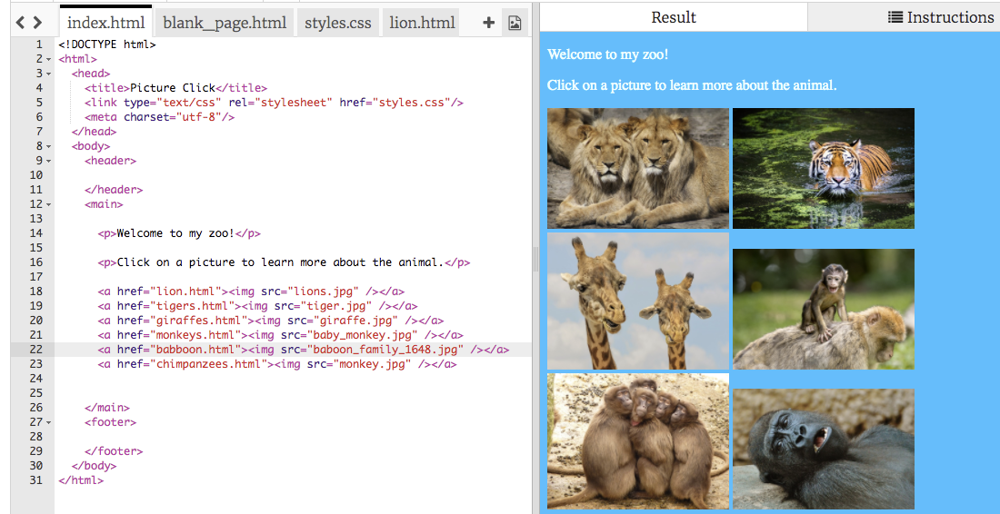

1. In questo progetto, realizzerai il sito Web di uno zoo! Vai a [dojo.soy/mini-trinket](http://dojo.soy/mini-trinket) e fai clic su **Remix**. Devi essere registrato su Trinket. Dopo aver fatto clic su **Remix**, clicca sul pulsante **Save** (Salva).

2. Fai clic sul tuo nome utente riportato sulla parte in alto a destra della schermata e seleziona **My Trinkets** (I miei Trinket). Identifica il progetto appena creato, denominato "WebPictures Remix" e cliccaci sopra per aprirlo.

3. Nel **code pane** (pannello del codice), vai alla scheda `styles.css`. Qui vedrai i colori utilizzati per il sito Web. Il colore del testo è rappresentato da `color`, mentre il colore di sfondo è determinato da `background-color`. Modifica i valori per scegliere i colori che preferisci. Per un elenco di nomi di colori da utilizzare, visita [dojo.soy/mini-web-colours](http://dojo.soy/mini-web-colours).

4. Per la prossima fase, devi avere la foto di un animale dello zoo che ti piace. Deve essere salvata sul computer. Se non ne hai una a disposizione, puoi effettuare una ricerca su Internet e scaricarne una o addirittura disegnarne una tua.

5. Fai clic sull’icona delle immagini situata a destra delle schede del codice e quindi su **Add Image** (Aggiungi immagine), **Upload** (Carica) e **Click To Select Files** (Fai clic per selezionare i file). Sul computer trova il file dell’immagine, selezionalo e fai clic su **Open** (Apri). Fai clic su **Done** (Fine).   
    

6. Adesso, fai clic sulla scheda `index.html` e aggiungi la seguente riga di codice in una nuova riga dopo l’ultimo tag `</p>`.

   ```html
        
   ```

   * Modifica `lions.jpg` con il nome del file della tua immagine. Il nome del file deve essere esattamente lo stesso. L’immagine dovrebbe ora apparire sulla pagina.
   
7. Qualora volessi modificare le dimensioni dell’immagine, vai sulla scheda `styles.css`. Le regole per le immagini si trovano nel blocco `img`:
   ```css
      img {
        width: 200px;
      }
   ``` 
   Modifica il numero riportato dopo `width` (larghezza). Nel caso cancellassi delle lettere o simboli, accertati di ridigitarli. Dovrebbe apparire così: `width: 450px;`

8. Trasformiamolo in un link che ti porti a una pagina tutta sull’animale in questione! Per prima cosa, crea una pagina nuova: fai clic sul simbolo **+** riportato di fianco all’icona delle immagini e digita `lion.html` dove è indicato il **file name** (nome del file).
   * Puoi modificarlo con qualsiasi animale, ma assicurati che il nome termini con `.html` in quanto è ciò che lo rende una **web page** (pagina Web).

9. Vai al file `blank_page.html`. Vedrai il codice che ti serve per una pagina vuota. Copialo nel tuo nuovo file.

10. Per aggiungere un paragrafo di testo, fai clic sullo spazio bianco tra i tag `<main></main>` e digita `<p></p>`. Digita il testo tra i tag, nel seguente modo: `<p>Questa pagina è tutta sui leoni!!!!</p>`. Puoi aggiungere quanti paragrafi desideri in questa modalità.
   * Prova anche ad aggiungere alcune immagini alla pagina!

11. Torna a `index.html`. Individua il codice dell’immagine e inseriscilo tra la coppia di tag `<a></a>` nel seguente modo:

   ```html
       <a href="lion.html"></a>
   ```
   Modifica `lion.html` con il nome della nuova pagina che hai creato.

12. Hai appena trasformato l’immagine in un link! Dovresti riuscire ora a fare clic sull’immagine e a visualizzare la pagina riguardante quell’animale.

13. In una nuova riga al di sotto del codice relativo a immagine e link, scrivi altra sintassi in modo da mostrare un’altra immagine con un link a un’altra pagina nuova. Non dimenticarti di caricare un file per l’immagine e di creare una pagina nuova! Aggiungi tutte le immagini e pagine che desideri. Quali animali si trovano nel tuo zoo?

14. Non dimenticare ogni tanto di fare clic su **Save** (Salva) per accertarti di non perdere il lavoro creato.  
 
Per imparare cos’altro puoi realizzare con il tuo sito Web e guadagnarti un adesivo digitale, visita <b>http://dojo.soy/mini-html-begin</b> e prova le Sushi Card per principianti di linguaggio HTML e CSS! Per visualizzare questa scheda online o per stamparne altre, visita <b>http://dojo.soy/mini-sushi-html</b> 



